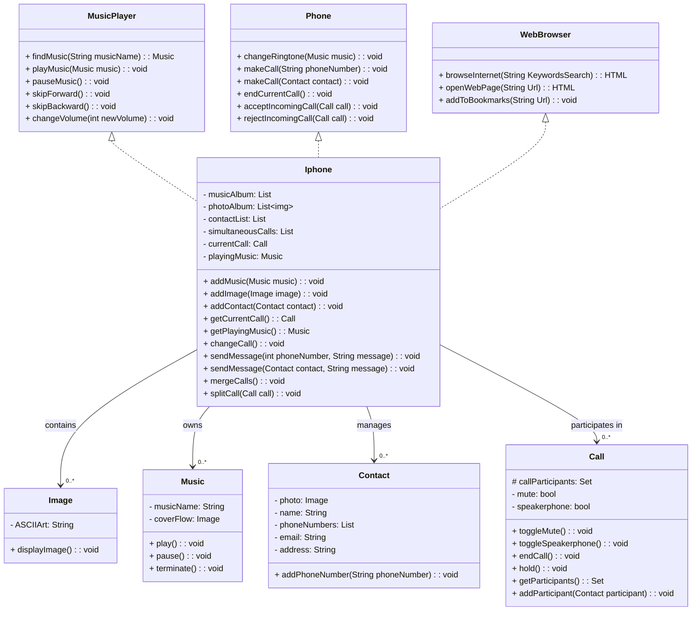

## UML Class Diagram

```mermaid
classDiagram
  class MusicPlayer {
    + findMusic(String musicName): Music
    + playMusic(Music music): void
    + pauseMusic(): void
    + skipForward(): void
    + skipBackward(): void
    + changeVolume(int newVolume): void
  }

  class Phone {
    + changeRingtone(Music music): void
    + makeCall(String phoneNumber): void
    + makeCall(Contact contact): void
    + endCurrentCall(): void
    + acceptIncomingCall(Call call): void
    + rejectIncomingCall(Call call): void
  }

  class WebBrowser {
    + browseInternet(String KeywordsSearch): HTML
    + openWebPage(String Url): HTML
    + addToBookmarks(String Url): void
  }

  class Iphone {
    - musicAlbum: List<Music>
    - photoAlbum: List<Image>
    - contactList: List<Contact>
    - simultaneousCalls: List<Call>
    - currentCall: Call
    - playingMusic: Music
    + addMusic(Music music): void
    + addImage(Image image): void
    + addContact(Contact contact): void
    + getCurrentCall(): Call
    + getPlayingMusic(): Music
    + changeCall(): void
    + sendMessage(int phoneNumber, String message): void
    + sendMessage(Contact contact, String message): void
    + mergeCalls(): void
    + splitCall(Call call): void
  }

  class Image {
    - ASCIIArt: String
    + displayImage(): void
  }

  class Music {
    - musicName: String
    - coverFlow: Image
    + play(): void
    + pause(): void
    + terminate(): void
  }

  class Contact {
    - photo: Image
    - name: String
    - phoneNumbers: List<int>
    - email: String
    - address: String
    + addPhoneNumber(String phoneNumber): void
  }

  class Call {
    # callParticipants: Set<Contact>
    - mute: bool
    - speakerphone: bool
    + toggleMute(): void
    + toggleSpeakerphone(): void
    + endCall(): void
    + hold(): void
    + getParticipants(): Set<Contact>
    + addParticipant(Contact participant): void
  }

  MusicPlayer <|.. Iphone
  Phone <|.. Iphone
  WebBrowser <|.. Iphone

  Iphone --> "0..*" Image : contains
  Iphone --> "0..*" Music : owns
  Iphone --> "0..*" Contact : manages
  Iphone --> "0..*" Call : participates in

```

[draw.io diagram](https://drive.google.com/file/d/1GLE3eBASx-tcptCyZ-q19_9_No5hzxbt/view?pli=1)
